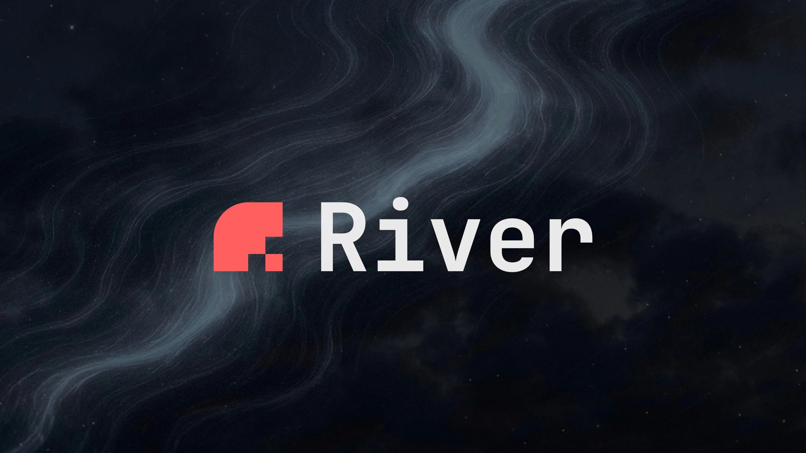

# River Framework



---

Vite-powered web framework bridging Go backends and TypeScript UIs

## Links

[river.now](https://river.now) |
[github.com](https://github.com/river-now/river) |
[pkg.go.dev](https://pkg.go.dev/github.com/river-now/river) |
[npmjs.com](https://www.npmjs.com/package/river.now) |
[x.com](https://x.com/riverframework)

## Quick Start

```sh
npm create river@latest
```

## What is River?

River is a lot like Next.js or Remix, but it uses Go on the backend, with your
choice of **_React_**, **_Solid_**, or **_Preact_** on the frontend.

It has **_nested routing_**, effortless **_end-to-end type safety_** (including
Link components!), **_parallel-executed route loaders_**, and much, much more.

It's deeply integrated with **_Vite_** to give you full **_hot module
reloading_** at dev-time.

## Get Started

If you want to dive right in, just open a terminal and run
`npm create river@latest` and follow the prompts.

If you'd prefer to read more first, take a peek at
[our docs](https://river.now/docs).

## Status

River's underlying tech has reached a good degree of stability, but its APIs are
still evolving. Sub-1.0 releases may contain breaking changes. If you ever need
help upgrading to the latest version, feel free to
[file an issue on GitHub](https://github.com/river-now/river) or
[reach out on X](https://x.com/riverframework).
